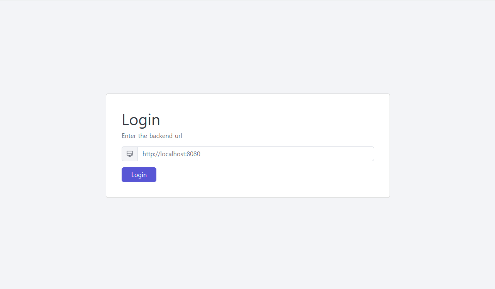
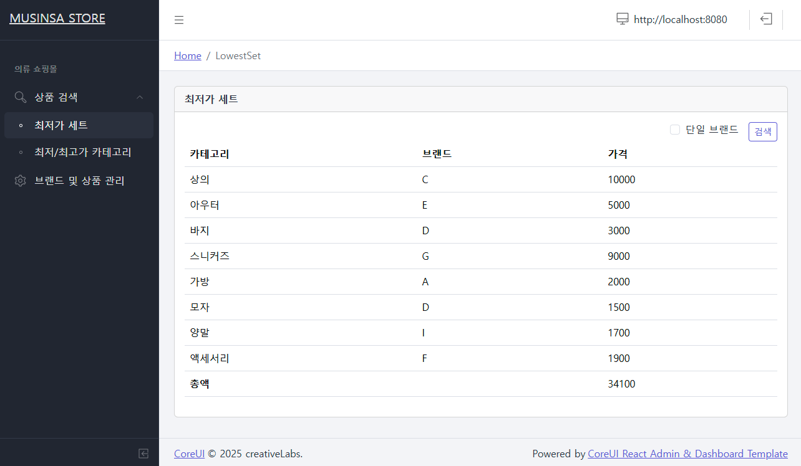
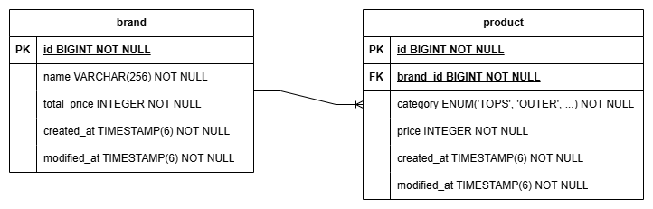

# Musinsa Store Server
무신사 Store Server (Backend Engineer 채용과제)

## Requirements

다음 8개의 카테고리에서 상품을 하나씩 구매하여, 코디를 완성하는 서비스를 준비중입니다.
1. 상의
2. 아우터
3. 바지
4. 스니커즈
5. 가방
6. 모자
7. 양말
8. 액세서리

- 구매 가격 외의 추가적인 비용(예, 배송비 등)은 고려하지 않고,  
브랜드의 카테고리에는 1개의 상품은 존재하고,  
구매를 고려하는 모든 쇼핑몰에 상품 품절은 없다고 가정합니다.

- 초기 데이터  
  |브랜드|상의|아우터|바지|스니커즈|가방|모자|양말|액세서리| 
  |---|---|---|---|---|---|---|---|---|
  |A|11,200|5,500|4,200|9,000|2,000|1,700|1,800|2,300|
  |B|10,500|5,900|3,800|9,100|2,100|2,000|2,000|2,200|
  |C|10,000|6,200|3,300|9,200|2,200|1,900|2,200|2,100|
  |D|10,100|5,100|3,000|9,500|2,500|1,500|2,400|2,000|
  |E|10,700|5,000|3,800|9,900|2,300|1,800|2,100|2,100|
  |F|11,200|7,200|4,000|9,300|2,100|1,600|2,300|1,900|
  |G|10,500|5,800|3,900|9,000|2,200|1,700|2,100|2,000|
  |H|10,800|6,300|3,100|9,700|2,100|1,600|2,000|2,000|
  |I|11,400|6,700|3,200|9,500|2,400|1,700|1,700|2,400|

- 구현 API  
  * 카테고리 별 최저가격 브랜드와 상품 가격, 총액을 조회하는 API  
  * 단일 브랜드로 모든 카테고리 상품을 구매할 때 최저가격에 판매하는 브랜드와  
    카테고리의 상품가격, 총액을 조회하는 API  
  * 카테고리 이름으로 최저, 최고 가격 브랜드와 상품 가격을 조회하는 API  
  * 브랜드 및 상품을 추가 / 업데이트 / 삭제하는 API  

## Development Enviroment
- Java 17
- SpringBoot 3.4.3
- SpringWeb 6.2.3
- SpringData JPA 3.4.3
- H2 database 2.3.232
- Gradle 8.12.1

## Quick Start

### Build
```
# ./gradlew build
```

### Test only
```
# ./gradlew unitTest          // Unit test
# ./gradlew integrationTest   // Integration test
```

### Run
```
# ./gradlew bootRun
```

### Web Frontend
서버 구동 후, 하기 web page에서 테스트할 수 있습니다.
https://sungtaek.github.io/musinsa-store

#### 1. 구동한 서버 url을 넣고 login 합니다.


#### 2. 메뉴에 따라 상품 검색 및 브랜드/상품 관리를 할수 있습니다.


## Package Structure

```
/
├── common/               // 공통 패키지
│   ├── config/             // Spring 설정
│   ├── exception/          // exception
│   ├── event/              // 내부 이벤트
│   ├── jpa/                // jpa 공통 Entity
│   ├── dto/                // 공통 DTO
│   └── cache/              // Cache 컴포넌트
│
├── product/              // 상품 기능 관련 패키지
│   ├── api/                // API Controller
│   │   └── dto/              // API DTO
│   ├── domain/             // Usecase 및 도메인 Entity
│   │   └── dto/              // 도메인 DTO
│   ├── repository/         // DB Repository
│   │   └── entity/           // 영속 Entity
│   └── exception/          // 기능 특화 exception
│
└── StoreApplication      // main application
```

## Application Architecture


## Configuration
- application.yml
```
server:
  port: 8080      # binding port

logging:
  level:          # log level
    root: info
    com.musinsa.store: debug

cache:
  active: true    # 검색 cache 사용 여부
  ttl: 60         # 검색 cache ttl (sec)
```

## Database Schema
- brand: 브랜드 정보 저장
  - id: 브랜드 id
  - name: 브랜드 이름
  - total_price: 브랜드 상품 가격 총합
  - created_at: 생성시간
  - modified_at: 수정시간

- product: 상품 정보 저장
  - id: 상품 id
  - brand_id: 브랜드 id
  - category: 카테고리
  - price: 상품 가격



## API Specification

Musinsa Store API Specification

Base URLs:

* <a href="http://localhost:8080">http://localhost:8080</a>

---
### Get Product Set API
`GET /api/v1/products/set`

*카테고리 별 최저/최고가격 브랜드와 상품 가격, 총액을 조회*

파라미터에 따라 최저/최고 가격, 전체/단일 브랜드에 대한 상품을 조회합니다.

<h4>Parameters</h4>

|Name|In|Type|Required|Default|Description|
|---|---|---|---|---|---|
|price|query|enum<br>LOWEST: 최저가<br>HIGHEST: 최고가|false|LOWEST|최저/최고 가격|
|singleBrand|query|boolean|false|false|단일 브랜드 여부|

<h4>Responses</h4>

|Status|Meaning|Description|Schema|
|---|---|---|---|
|200|[OK](https://tools.ietf.org/html/rfc7231#section-6.3.1)|Success|[ResponseProductSet](#response-product-set)|
|400|[Bad Request](https://tools.ietf.org/html/rfc7231#section-6.5.1)|Bad request|[ResponseProductSet](#response-product-set)|
|500|[Internal Server Error](https://tools.ietf.org/html/rfc7231#section-6.6.1)|Internal error|[ResponseProductSet](#response-product-set)|

<h5 id="response-product-set">Response Product Set</h5>

|Name|Type|Required|Description|
|---|---|---|---|
|code|string|true|result code|
|message|string|true|result message|
|data|[ResultProductSet](#result-product-set)|false|product set|


> Example

```json
> GET http://localhost:8080/api/v1/products/set?price=LOWEST&singleBrand=false

< 200 OK
{
  "code": "0000",
  "message": "Success",
  "data": {
    "lowestPrice": {
      "products": [
        {
         "category": "BAGS",
         "brandName": "A",
         "price": 2000
        },
        {
          "category": "TOPS",
          "brandName": "C",
          "price": 10000
        },
        {
          "category": "PANTS",
          "brandName": "D",
          "price": 3000
        },
        {
          "category": "HATS",
          "brandName": "D",
          "price": 1500
        },
        {
          "category": "OUTER",
          "brandName": "E",
          "price": 5000
        },
        {
          "category": "ACCESSORIES",
          "brandName": "F",
          "price": 1900
        },
        {
          "category": "SNEAKERS",
          "brandName": "G",
          "price": 9000
        },
        {
          "category": "SOCKS",
          "brandName": "I",
          "price": 1700
        }
      ],
      "totalPrice": 34100
    }
  }
}

```


### Get Product By Category API
`GET /api/v1/products/by-category`

*카테고리 이름으로 최저/최고 가격 브랜드와 상품 가격을 조회*

카테고리 이름을 파라미터로 받아서 해당 카테고리의 최저/최고 가격의 상품을 조회합니다.

<h4>Parameters</h4>

|Name|In|Type|Required|Default|Description|
|---|---|---|---|---|---|
|category|query|[CategoryCode](#category-code)|true||카테고리 코드|
|price|query|enum<br>LOWEST: 최저가<br>HIGHEST: 최고가<br>LOWEST_HIGHEST: 최저&최고가|false|LOWEST|최저/최고 가격|
|singleBrand|query|boolean|false|false|단일 브랜드 여부|

<h4>Responses</h4>

|Status|Meaning|Description|Schema|
|---|---|---|---|
|200|[OK](https://tools.ietf.org/html/rfc7231#section-6.3.1)|Success|[ResponseProductCategory](#response-product-category)|
|400|[Bad Request](https://tools.ietf.org/html/rfc7231#section-6.5.1)|Bad request|[ResponseProductCategory](#response-product-category)|
|500|[Internal Server Error](https://tools.ietf.org/html/rfc7231#section-6.6.1)|Internal error|[ResponseProductCategory](#response-product-category)|

<h5 id="response-product-category">Response Product Category</h5>

|Name|Type|Required|Description|
|---|---|---|---|
|code|string|true|result code|
|message|string|true|result message|
|data|[ResultProductSet](#result-product-set)|false|product set|


> Example

```json
> GET http://localhost:8080/api/v1/products/by-category?category=TOPS&price=LOWEST_HIGHEST

< 200 OK
{
  "code": "0000",
  "message": "Success",
  "data": {
    "category": "TOPS",
    "lowestPrice": {
      "products": [
        {
          "category": "TOPS",
          "brandName": "C",
          "price": 10000
        }
      ]
    },
    "highestPrice": {
      "products": [
        {
          "category": "TOPS",
          "brandName": "I",
          "price": 11400
        }
      ]
    }
  }
}
```


### Get Brand List API
`GET /api/v1/brands`

*브랜드 리스트 조회*

브랜드 리스트를 페이지 단위로 조회합니다.


### Create Brand API
`POST /api/v1/brands`

*브랜드/상품 생성*

신규 브랜드 및 상품 정보를 받아서 생성합니다.

### Get Brand API
`GET /api/v1/brands/{id}`

*브랜드/상품 조회*

브랜드 id를 받아서 해당 브랜드 및 상품 정보를 조회합니다.

### Update Brand API
`POST /api/v1/brands/{id}`

*브랜드/상품 업데이트*

브랜드 id 와 브랜드 정보를 받아서 해당 브랜드 및 상품 정보를 업데이트 합니다.

### Delete Brand API
`DELETE /api/v1/brands/{id}`

*브랜드/상품 삭제*

브랜드 id를 받아서 해당 브랜드 및 상품 정보를 삭제 합니다.


### Data Schema

<h5 id="result-product-set">Result Product Set</h5>

|Name|Type|Required|Description|
|---|---|---|---|
|category|string|false|카테고리명 (단일 카테고리 검색시)|
|lowestPrice|[CategoryProductSet](#category-product-set)|false|최저가 세트 (최저가 검색시)|
|highestPrice|[CategoryProductSet](#category-product-set)|false|최고가 세트 (최고가 검색시)|

<h5 id="category-product-set">Category Product Set</h5>

|Name|Type|Required|Description|
|---|---|---|---|
|bandName|string|false|브랜드명 (단일 브랜드 조회시)|
|products|[[CategoryProduct](#category-product)]|true|상품 리스트|
|totalPrice|integer|true|가격 총합|

<h5 id="category-product">Category Product</h5>

|Name|Type|Required|Description|
|---|---|---|---|
|category|[CategoryCode](#category-code)|true|카테고리 코드|
|bandName|string|true|브랜드명|
|price|integer|true|가격|

<h5 id="category-code">Category Code</h5>

|Code|Description|
|---|---|
|TOPS|상의|
|OUTER|아우터|
|PANTS|바지|
|SNEAKERS|스니커즈|
|BAGS|가방|
|HATS|모자|
|SOCKS|양말|
|ACCESSORIES|악세서리|
